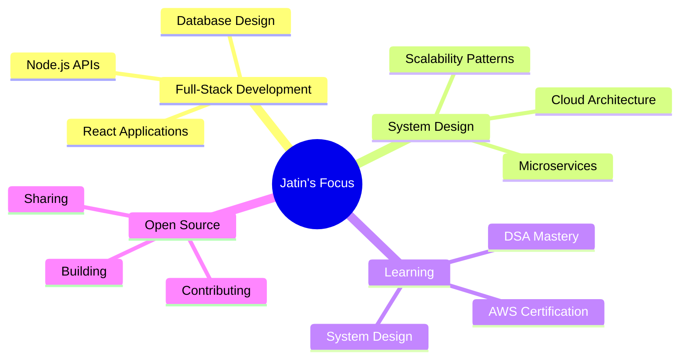

<!-- Animated Header Banner -->
<div align="center">

<!--  -->
<div align="center">
  
</div>


</div>

<!-- Typing Animation -->
<!-- <p align="center">
  
</p> -->

<!-- Animated GIF -->


<!-- Profile Views & Activity -->
<p align="center">
  
  
  
</p>

<br/>

<!-- Interactive SVG Divider -->


<br/>

## 👋 About Me
<div align="center">

<table border="0" cellspacing="0" cellpadding="0">
<tr>

<td width="60%" align="left" valign="middle">

### I'm Jatin — Full-Stack Engineer & Product Builder  
📍 Ahmedabad, Gujarat, India  
💼 Building scalable, reliable, production-grade web systems  

</td>

<td width="40%" align="center" valign="middle">


</td>

</tr>
</table>

</div>

---

### Who I Am

Computer Science student and full-stack web developer passionate about building real-world applications and exploring new technologies.

I specialize in taking ideas from **concept to production** — crafting intuitive frontend experiences, engineering robust backend systems, and deploying high-performance applications on modern cloud infrastructure.

I enjoy working across the entire development lifecycle, from system design and architecture to implementation, optimization, and deployment.

---

## Philosophy  
**Build systems that matter. Write code that lasts.**

---

## 🛠 What I Build

I design and build full-stack web applications focused on clean architecture, performance, and real-world usability.

<div align="center">

<table>
<tr>

<td align="center" width="25%">
  <br/>
  <br/><br/>
  <b>Frontend Applications</b><br/><br/>
  Responsive, high-performance UI systems
  <br/><br/>
</td>

<td align="center" width="25%">
  <br/>
  <br/><br/>
  <b>Backend APIs</b><br/><br/>
  Secure, modular server-side systems
  <br/><br/>
</td>

<td align="center" width="25%">
  <br/>
  <br/><br/>
  <b>Databases</b><br/><br/>
  Structured data models & persistence layers
  <br/><br/>
</td>

<td align="center" width="45%">
  <br/>
  <br/><br/>
  <b>Cloud Fundamentals</b><br/><br/>
  Deployment, hosting & monitoring basics
  <br/><br/>
</td>

</tr>
</table>

</div>

<div align="center">

Full-stack web applications • API-driven systems • Database-backed platforms • Cloud deployment fundamentals

</div>


## 🌐 Connect With Me

<div align="center">

<a href="mailto:jatinrajvani.cg@gmail.com">
  
</a>
&nbsp;&nbsp;&nbsp;

<a href="https://www.linkedin.com/in/jatin-rajvani/">
  
</a>
&nbsp;&nbsp;&nbsp;

<a href="https://github.com/JatinRajvani">
  
</a>
&nbsp;&nbsp;&nbsp;

<a href="https://leetcode.com/Jatinrajvani">
  
</a>

<br/><br/>

<a href="https://youtube.com/@YOUR_YOUTUBE_CHANNEL">
  
</a>
&nbsp;&nbsp;&nbsp;

<a href="https://jatinsportfolio.vercel.app/">
  
</a>

</div>


<br/>

<!-- Animated Divider -->


<br/>

## 🛠️ Tech Arsenal

<div align="center">

### Languages & Core
<p>
  
</p>

### Frontend Development
<p>
  
</p>

### Backend & Database
<p>
  
</p>

### Cloud & DevOps
<p>
  
</p>

### Tools & Environment
<p>
  
</p>

</div>

<details>
<summary>📦 <b>Click to see detailed tech breakdown</b></summary>
<br/>

**Frontend:**
- ⚛️ React - Building interactive UIs
- 🎨 HTML5/CSS3 - Modern, responsive layouts
- 🎯 JavaScript ES6+ - Clean, modern code

**Backend:**
- 🚀 Node.js - Server-side JavaScript runtime
- ⚡ Express.js - Fast, minimalist web framework
- 🔐 JWT - Secure authentication & authorization

**Databases:**
- 🍃 MongoDB - NoSQL for flexible data models
- 🐬 MySQL - Relational database management

**Cloud & Deployment:**
- ☁️ AWS - Cloud infrastructure & services
- 🔷 Vercel - Frontend deployment platform
- 🎨 Render - Backend hosting solution

**Currently Learning:**
- 📊 Data Structures & Algorithms
- 🏗️ System Design & Architecture
- ☁️ Advanced AWS Services
- 🔄 Microservices Patterns

</details>

<br/>

<!-- Animated Divider -->


<br/>

## 📊 GitHub Analytics

<div align="center">

<!-- GitHub Stats Cards -->


<!-- Language Stats & Activity Graph -->


<!-- Contribution Snake -->
<picture>
  <source media="(prefers-color-scheme: dark)" srcset="https://raw.githubusercontent.com/JatinRajvani/JatinRajvani/output/github-contribution-grid-snake-dark.svg">
  <source media="(prefers-color-scheme: light)" srcset="https://raw.githubusercontent.com/JatinRajvani/JatinRajvani/output/github-contribution-grid-snake.svg">
  
</picture>

<!-- Trophies -->


</div>

<br/>

<!-- Animated Divider -->


<br/>

## 🚀 Featured Projects

<div align="center">

<!-- Project 1 -->
<details>
<summary><b>🛍️ Scalable E-Commerce Platform - Click to expand</b></summary>
<br/>

<div align="left">

**A production-ready marketplace with real-time inventory management**

🎯 **Key Features:**
- RESTful API handling 10K+ daily requests
- JWT-based authentication with RBAC
- MongoDB schema optimization (60% faster queries)
- Automated CI/CD pipeline on AWS

📦 **Tech Stack:**
```
Frontend: React, HTML5, CSS3
Backend: Node.js, Express.js
Database: MongoDB
Cloud: AWS S3, Vercel
Auth: JWT
```

📈 **Metrics:**
- ✅ 99.9% uptime
- ⚡ <200ms average response time
- 🔥 10K+ daily active requests

🔗 [View Repository](#) | [Live Demo](#)

</div>

</details>

<!-- Project 2 -->
<details>
<summary><b>🔐 Authentication Microservice - Click to expand</b></summary>
<br/>

<div align="left">

**Secure, reusable auth service for multi-tenant applications**

🎯 **Key Features:**
- JWT token refresh with secure rotation
- Rate limiting & brute-force protection
- OAuth2 integration (Google, GitHub)
- Auto-scaling on Render

📦 **Tech Stack:**
```
Backend: Node.js, Express.js
Database: MySQL
Auth: JWT, OAuth2
Deployment: Render
```

📈 **Metrics:**
- ✅ 5K+ daily auth requests
- ⚡ <150ms response time
- 🛡️ Zero security incidents

🔗 [View Repository](#) | [Documentation](#)

</div>

</details>

<!-- Project 3 -->
<details>
<summary><b>📊 Real-Time Analytics Dashboard - Click to expand</b></summary>
<br/>

<div align="left">

**Data visualization platform processing millions of records**

🎯 **Key Features:**
- Interactive React dashboard with Chart.js
- WebSocket integration for live updates
- Query optimization (2s → <300ms)
- Data aggregation pipeline

📦 **Tech Stack:**
```
Frontend: React, Chart.js
Backend: Node.js, Express.js
Database: MongoDB
Real-time: WebSockets
Cloud: AWS EC2
```

📈 **Metrics:**
- ✅ 85% faster query performance
- ⚡ Real-time data synchronization
- 📊 10M+ records processed

🔗 [View Repository](#)

</div>

</details>

</div>

<br/>

<!-- Animated Divider -->


<br/>

## 🏆 Achievements & Contributions

<div align="center">

<!-- Top Contributed Repos -->


</div>

<br/>

<!-- Animated Divider -->


<br/>

## 💭 Developer Wisdom

<div align="center">


</div>

<br/>

<!-- Animated Divider -->


<br/>

## 📈 Contribution Activity

<div align="center">

<!-- Contribution Calendar -->


</div>

<br/>

<!-- Animated Divider -->


<br/>

## 🎯 Current Focus

<div align="center">



</div>

<br/>

<!-- Animated Divider -->


<br/>

## 📫 Let's Collaborate

<div align="center">

**Building something interesting? Let's connect!**

I'm always open to:
- 💼 **Job opportunities** in full-stack development
- 🤝 **Collaborations** on impactful projects
- 🌟 **Open source** contributions
- 💬 **Technical discussions** about system design

<br/>

### Quick Links

<table>
<tr>
<td align="center" width="25%">

**📧 Email**  
[jatinrajvani.cg@gmail.com](mailto:jatinrajvani.cg@gmail.com)

</td>
<td align="center" width="25%">

**💼 LinkedIn**  
[Connect with me](https://linkedin.com/in/Jatin-Rajvani)

</td>
<td align="center" width="25%">

**🐦 Bluesky**  
[Follow me](https://bsky.app/profile/Jatin-Rajvani)

</td>
<td align="center" width="25%">

**💻 GitHub**  
[Star my repos](https://github.com/JatinRajvani)

</td>
</tr>
</table>

</div>

<br/>

<!-- Footer Wave -->


<div align="center">

### Show some ❤️ by starring repositories you find interesting!


**⭐ From [JatinRajvani](https://github.com/JatinRajvani) with 💙**

</div>

---

<div align="center">
<sub>Built with 💻 and ☕ | Last updated: January 2026</sub>
</div>
